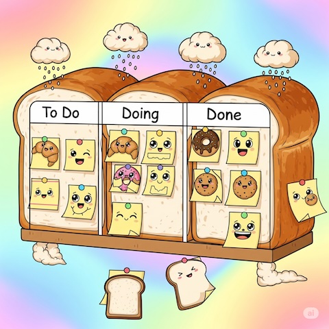

# shokupan



A cross-platform Kanban/Trello-style application that works entirely on top of IMAP. Different lists are mailboxes, and cards are emails.

## Features

- **IMAP-based**: Uses your email account as the backend
- **Cross-platform**: Works on Windows, macOS, and Linux
- **Dual interface**: Both CLI and GUI applications
- **Keyboard shortcuts**: Extensive keyboard support in GUI
- **No caching**: Direct IMAP operations (initial version)
- **Single account**: Supports one IMAP account per session

## Architecture

- **Core**: IMAP client and data models
- **CLI**: Command-line interface for automation and testing
- **GUI**: Qt-based graphical interface

## Building

### Prerequisites

- Qt6 (6.2 or later)
- CMake (3.16 or later)
- C++17 compatible compiler

### Build Instructions

```bash
mkdir build
cd build
cmake ..
make
```

### Cross-platform Static Builds

The project uses CMake and Qt6 to generate static executables for:
- Windows (x64)
- macOS (x64, ARM64)
- Linux (x64)

## Development

### Testing with Dovecot

A Docker setup is provided to run a local Dovecot IMAP server for testing:

```bash
cd docker
docker-compose up -d
```

For automated CLI end-to-end tests there's a simple harness in `tests/cli_e2e.sh` which starts the docker environment, runs the CLI against it (using `--config`) and tears down the containers.


This creates a test environment with predefined mailboxes and test emails.

### CLI Usage

```bash
# List mailboxes
./imap-kanban-cli list-mailboxes

# Show cards in a mailbox
./imap-kanban-cli show-cards "TODO"

# Move card between mailboxes
./imap-kanban-cli move-card <email-id> "TODO" "DONE"
```

### GUI Usage

Launch the GUI application:

```bash
./imap-kanban-gui
```

#### Keyboard Shortcuts

- `Ctrl+N`: New card
- `Ctrl+E`: Edit card
- `Del`: Delete card
- `Ctrl+M`: Move card
- `F5`: Refresh
- `Ctrl+,`: Settings

## License

MIT License

## vibe ✨

here's how I started in all-hands.dev
```
I want to build a simple kanban trello style app which works entirely on top of IMAP: the different lists are mailboxes, and the cards are emails. since I'd like to use this in a cross platform way and imap is not possible with javascript, I'd like to use Qt to build this.
to facilitate use from command line and testing, there should be a CLI in addition to the GUI.
in the initial version let's assume there's no caching, a single imap account and the settings page lets the user choose which mailboxes to show.
the GUI should have keyboard shortcuts for as many operations as possible.
the build system should work cross platform and generate a single static executable, and the github repo should use CI/actions to build executables for each platform
in terms of development and testing, it might be useful to run a dovecot imap server on localhost (maybe in docker) to test the CLI against. since dovecot (by default in debian at least) stores mail in standard mbox format, it should be straightforward to create, run and test specific cases. once the cli is working correclty, then the gui should be "just" a view & controller over the same model that the cli works with.
```
